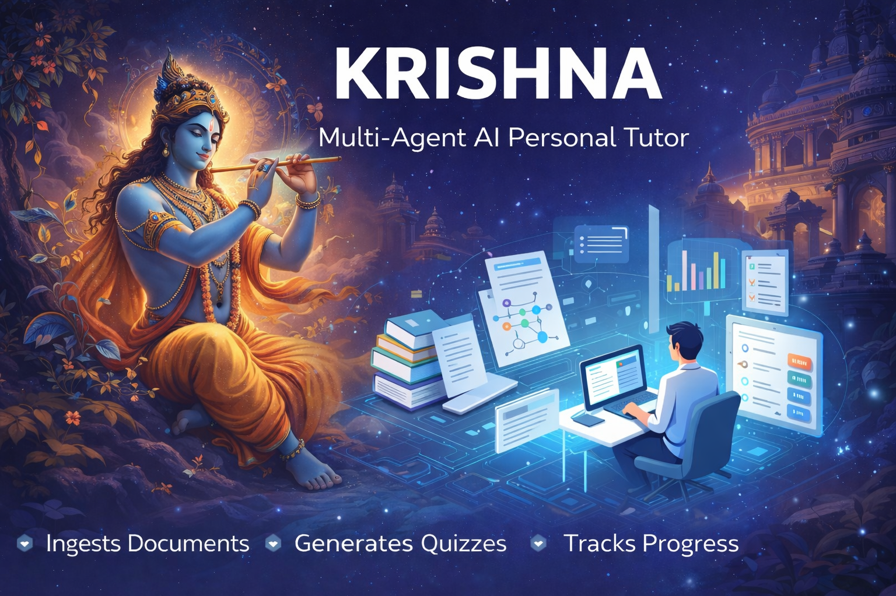

# KRISHNA: The AI-Powered Tutor

 *An advanced, context-aware AI Tutoring platform that adapts to your learning materials.*

KRISHNA is an intelligent, full-stack educational application designed to act as your personalized tutor. Unlike generic AI chatbots, KRISHNA allows you to upload your own syllabus, notes, and study materials, creating an isolated knowledge base for every subject. It uses advanced Retrieval-Augmented Generation (RAG) to answer your questions, generates personalized MCQ quizzes to test your mastery, and tracks your progress over time through visual analytics.

---

## 🚀 Key Features

- **ChatGPT-Style Interactive UI:** Familiar, responsive, and intuitive chat layout with markdown support, chat histories, and dedicated session management.
- **Context-Aware Knowledge Base:** Upload PDFs, TXT, and DOCX files to "ground" the AI. The AI strictly answers based on the uploaded material to prevent hallucinations.
- **Mastery Quizzes on Demand:** Automatically generate 5-question multiple-choice quizzes on any topic based on your chat context.
- **Instant Grading & Feedback:** Submit your answers to receive instant evaluation, including detailed explanations for both correct and incorrect answers.
- **Deep Analytics tracking:** Monitor your learning trajectory over time with the Progress tab. View accuracy trends, identify weak vs. strong topics, and receive actionable study recommendations.

---

## 🏗 Architecture

KRISHNA is built with a separated frontend-backend architecture to ensure scalability, ease of development, and maintainability.

### Request Lifecycle
1. User uploads a document via the React Frontend.
2. The FastAPI backend receives the file, pushes it to AWS S3 for persistent storage, and extracts/indexes the text embeddings.
3. User asks a question in the Chat.
4. Backend retrieves relevant document chunks, forms a prompt using OpenRouter LLMs, and streams the response back to the UI.
5. User requests a Quiz. The AI agent generates a structured JSON response of questions, which the frontend renders as interactive React components.
6. Quiz results are evaluated by the backend, saved to the database, and fed into the Analytics Agent to provide feedback.

### Directory Structure

```text
KRISHNA/
├── backend/                  # FastAPI Application
│   ├── app/
│   │   ├── api/              # RESTful route definitions (chat, upload, quiz)
│   │   ├── services/         # Core business logic (Vector ingestion, AWS handling)
│   │   ├── models/           # Pydantic schemas and database models
│   │   ├── agents/           # Specialized LLM agents (e.g., AnalyticsAgent, QuizAgent)
│   │   ├── config.py         # Environment configuration
│   │   └── main.py           # FastAPI app entry point
│   ├── run.py                # Uvicorn server runner
│   └── requirements.txt      # Python dependencies
├── frontend/                 # React + Vite Application
│   ├── public/               # Static assets
│   ├── src/
│   │   ├── components/       # Shared UI components (Navbars, Buttons)
│   │   ├── pages/            # View-level components (AppPage, LandingPage)
│   │   ├── services/         # API integration (axios instances)
│   │   ├── App.tsx           # React Router setup
│   │   └── index.css         # Global design system & tokens
│   ├── package.json          # Node dependencies
│   ├── vite.config.ts        # Vite build configuration
│   └── .env                  # Frontend environment variables
└── README.md                 # Project documentation
```

---

## ☁️ AWS Services Used

- **Amazon S3 (Simple Storage Service):** 
  KRISHNA uses AWS S3 as the primary blob object storage layer for user documents. When a student uploads a study material (like a 50MB PDF textbook), it relies on `boto3` to securely transfer and store the raw file into an S3 bucket before the text chunking and vector embedding process begins. This ensures original source documents are never lost and can be re-indexed if the vector database schema changes.

---

## 💻 Tech Stack

- **Frontend:** React 18, TypeScript, Vite, Vanilla CSS (Custom Design System), Recharts (for analytics), Lucide React (for iconography)
- **Backend:** Python 3.10+, FastAPI, Uvicorn, Pydantic (for strict data validation), Boto3 (AWS SDK)
- **AI / LLM Integration:** OpenRouter API
- **Deployment & Infra (Configured):** AWS S3, local/remote Vector DB mappings

---

## 🛠 How to Run Locally

If you wish to run KRISHNA on your local machine for development or testing, follow this granular setup guide.

### Prerequisites
- Node.js 18+ and `npm`
- Python 3.10+
- An AWS Account (with Access Keys for S3)
- An OpenRouter API Key

### 1. Clone the Repository
```bash
git clone https://github.com/your-username/KRISHNA.git
cd KRISHNA
```

### 2. Setup the Backend
Open a new terminal session and navigate to the backend directory.

```bash
cd backend

# Create a virtual environment
python -m venv venv

# Activate the virtual environment
# On Windows:
venv\Scripts\activate
# On macOS/Linux:
source venv/bin/activate

# Install dependencies
pip install -r requirements.txt
```

### 3. Backend Environment Variables
Create a `.env` file in the root directory (or inside `backend/` depending on your setup) and populate it:

```env
APP_NAME=KRISHNA
DEBUG=true
PORT=8000

# LLM Provider (OpenRouter)
OPENROUTER_API_KEY=your_openrouter_api_key
OPENROUTER_MODEL=openai/gpt-4o

# AWS S3 Configuration
AWS_ACCESS_KEY_ID=your_aws_access_key
AWS_SECRET_ACCESS_KEY=your_aws_secret_key
AWS_REGION=us-east-1
S3_BUCKET_NAME=krishna-documents-local
```

### 4. Start the Backend Server
```bash
python run.py
```
*The FastAPI server should now be running at `http://localhost:8000`.*

### 5. Setup the Frontend
Open a second terminal session and navigate to the frontend directory.

```bash
cd frontend

# Install Node dependencies
npm install
```

### 6. Frontend Environment Variables
Create a `.env` file inside the `frontend/` directory to point the React app to your FastAPI backend:

```env
VITE_API_URL=http://localhost:8000/api/v1
```

### 7. Start the Frontend Dev Server
```bash
npm run dev
```
*Vite will start the dev server, usually accessible at `http://localhost:5173`.*

---

## 🧭 Demo Workflow

To experience the full power of KRISHNA, try the following sequence once the app is running:

1. **Access the App:** Open the frontend URL in your browser. Read through the landing page and click **"Launch KRISHNA App"**.
2. **Start a Session:** Click **"New Chat"** in the left sidebar to isolate your context.
3. **Upload Context:** Click the **"Knowledgebase"** tab at the top. Drag and drop a sample PDF (e.g., a chapter on Biology or a research paper) and wait for the indexing success message.
4. **Learn:** Return to the **"Chat"** tab. Ask a specific question about the document you just uploaded. Watch the AI reason and answer using solely your provided context.
5. **Test Yourself:** Switch to the **"Quizzes"** tab. Type a topic related to your document and click **"Generate Quiz"**. 
6. **Evaluate:** Answer the 5 multiple-choice questions natively rendered with custom radio buttons, then click **"Submit Answers"**. Read the explanations for why you got questions right or wrong.
7. **Track Progress:** Finally, navigate to the **"Progress"** tab to view your Recharts-powered analytics. See your accuracy by topic, check the trend line of your scores, and read AI-generated recommendations on what to study next based on your weak points.

---

## 🔭 Future Work

The roadmap for KRISHNA involves scaling it from a local prototype to a production-ready SaaS application:

- **Database Persistence:** Implement PostgreSQL with SQLAlchemy & Alembic to permanently save user accounts, chat histories, and progress across devices.
- **Managed Vector Database:** Transition from in-memory processing to a production Vector DB (like Pinecone, Qdrant, or Weaviate) to handle massive syllabus libraries and rapid semantic search.
- **Authentication System:** Integrate OAuth2 and JWT-based user authentication (Google Login / GitHub Login) so multiple students can use the platform with distinct data silos.
- **Export & Reporting:** Allow users to export their quizzes and analytics as PDF reports for offline review.
- **Vercel / AWS EC2 Deployment Pipelines:** Finalize CI/CD pipelines utilizing GitHub actions for automated testing and zero-downtime deployments.
